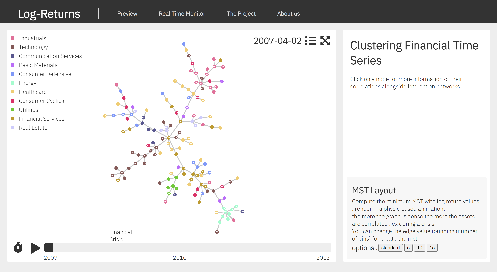

# log_returns 📈




- Website link : [here](https://log-returns.vercel.app) !!!

- Video demo : [here](https://drive.google.com/file/d/1wPa14Ffe22kQ0mkvphe38TNsmUZIkYer/view?usp=sharing).

- Project process book : [here](/milestones/Team%20AvanTuRiais%20-%20PROCESS%20BOOK.pdf).

### Context

Correlation between stock prices gives powerful insights into the evolution of financial systems in interesting periods: during a financial crisis, political instability, or significant economic development of a country. Correlation tells us a lot about how stocks are linked, such as how industries are dependent on or independent of crisis or development in specific economic sectors.
The goal of this visualization is to represent the evolution in time of correlation, hierarchies and clustering of various financial stocks.

## Dependencies

Install Node.js, this will include the npm and yarn package managers

## Front-End

```
cd front-end
yarn
yarn dev
```

## Back-end

Our setup is very flexible , we have a preview with a static dataset of asset logreturns that you can find in the public folder of the front-end, but we can also connect to an API. In our real-time page we connect to the FTX api for crypto-currencies returns using serverless functions for the backend graph computation, but for more custom and optimized scenarios we have a docker container in case you want to deploy your own API and connect the front-end.

```
cd back-end
docker compose up
```

### Team

- Etienne Salimbeni
- Carlo Musso
- Filippo Salmina
